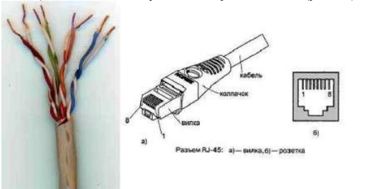
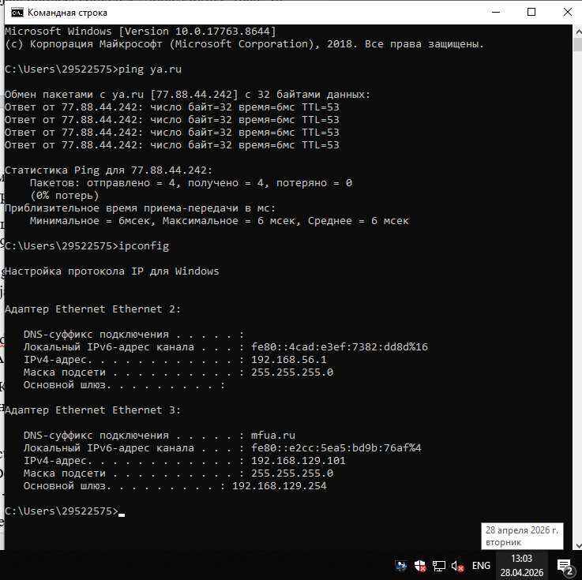

# Лабораторная работа № 1 «Подключение персональногокомпьютера к локальной вычислительной сети»
## Цель работы:
приобретение практических знаний и навыков в выборе и установке сетевых адаптеров, монтажу и разделке сетевого кабеля, физическому присоединению ЭВМ к кабельной системе при создании локальной компьютерной сети по технологии Ethernet.

## Материалы, оборудование, программное обеспечение: 
IBM PCсовместимый персональный компьютер, сетевая карта (для шины данных PCI) производительностью 10-100 Mbit/сек с разъемом RJ-45, кабель UTP
категории 5, вилки RJ-45, обжимной инструмент.
Критерии положительной оценки: выполнение типового задания, оформление отчета по работе, ответы на вопросы для самопроверки. 

## Теоретическое введение

Сетевой стандарт Ethernet был разработан в 1975-х гг. в
исследовательском центре корпорации Xerox, после чего доработан совместно DEC, Intel и XEROX (отсюда сокращение DIX) и впервые опубликован как 'Blue Book Standart' для Ethernet I в 1980 г. Этот стандарт
получил дальнейшее развитие и в 1985 г. вышел новый - Ethernet II (известный также как DIX). На основе стандарта Ethernet DIX был разработан стандарт IEEE 802.3, одобренный в 1985 г. для стандартизации комитетом по LAN IEEE (Institute of Electrical and Electronics Engineers). В зависимости от вида физической среды передачи данных стандарт IEEE 802.3 имеет модификации (число 10 в начале
каждой обозначает скорость передачи данных 10 Мбит/сек): • 10Base-5 (применяется коаксиальный кабель диаметром 0,5 дюйма – так называемый толстый коаксиал с волновым сопротивлением 50 ом; максимальная длина сегмента сети без повторителей 500 м, считается
бесперспективным).
• 10Base-2 (коаксиальный кабель диаметром 0,25 дюйма - так называемый тонкий коаксиал, волновое сопротивление 50 ом; максимальная длина сегмента сети без повторителей 185 м, считается бесперспективным).
• 10Base-T (кабель на основе неэкранированной витой пары - UTP, Un shielded Twisted Pair; физическая топология - звезда с концентратором в
центре, максимальное расстояние между концентратором и конечным узлом - до 100 м).
• 10Base-F (волоконно-оптический кабель, топология сети аналогична 10BaseT; варианты: FOIRL допускает расстояние до 1000 м, 10Base-FL и
10Base-FB - до 2000 м).
В 1995 г. принят стандарт Fast Ethernet (IEEE 802.3u), в 1998 г. - Gigabit Ethernet (IEEE 802.3z), в 2002 г. - 10 Gigabit Ethernet (IEEE
802.3ae). Ethernet и Fast Ethernet применяют один и тот же метод разделения среды передачи данных CSMA/CD (Carrier Sense Multiple Access with
Collision Detection, метод коллективного доступа с опознаванием несущей и обнаружением коллизий).
Кабель UTP является наиболее дешевым (при обеспечении достаточной скорости передачи данных и простоте монтажа). UTP-кабели категории 1 применяются в основном для телефонной разводки, UTP категории 3 служат для передачи как голоса, так и данных при невысокой производительности (диапазон частот до 16 MHz). Для высокоскоростных протоколов при
передаче на большие расстояния могут применяться (более дорогие) кабели UTP категорий 6 и 7 (экран вокруг каждой пары и вокруг всех жил соответственно, рабочие частоты до 300 и 600 MHz). В настоящее время при создании локальных компьютерных сетей
практически всегда (для технологий Ethernet, Fast Ethernet и Gigabit Ethernet) применяют кабель UTP категории 5 (8 попарно скрученных медных жил,
активное сопротивление не более 9,4 ом на 100 м, полное волновое сопротивление 100 ом на частоте 100-120 MHz, затухание сигнала 0,8-22 дБ
6 на частотах от 64 kHz до 100 MHz). Каждый провод кабеля UTP маркирован цветом (синий и белый с синими полосками, оранжевый и белый с оранжевыми полосками, зеленый и белый с зелеными полосками, коричневый и белый с коричневыми полосками по скрученным парам
соответственно), для UTP-кабеля применяются разъемы RJ-45 (рис. 1.1).

