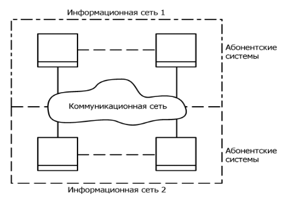
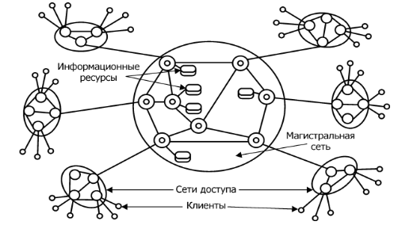

# Лекция № 1. Введение
## Основные понятия дисциплины

Сеть (Network) – взаимодействующая совокупность объектов
(узлов, nodes).

```Компьютерная сеть или сеть передачи данных``` (Computer Network) –
это совокупность связанных между собой компьютеров, телекоммуникаци-
онного оборудования и программного обеспечения, обеспечивающая ин-
формационный обмен между компьютерами в сети.

```Узел компьютерной сети``` – хост или конечная система.
Конечные системы соединяются между собой при помощи линий
связи и коммутаторов пакетов.
Пакеты – отдельные порции информации, передаваемые по сети.
### Состав компьютерной сети.

− Компьютеры, соответствующие назначению компьютерной сети;

− Коммуникационное оборудование;

− Сетевые операционные системы (NOS – Network Operation System);

− Сетевые приложения.

```Телекоммуникации``` – (греч. tele – вдаль, далеко и лат. communicatio –
общение) – это передача и прием любой информации (звука, изображения,
данных, текста) на расстояние по различным электромагнитным системам.
Телекоммуникационная сеть – это система технических средств, по-
средством которой осуществляются телекоммуникации.

Телекоммуникационную сеть условно принято разделять на коммуни-
кационную сеть и информационную сеть (см. рис. 1.1).

Коммуникационная сеть – предназначена для передачи данных.
Информационная сеть – предназначена для обработки, хранения и
передачи данных и создается подключением к коммуникационной сети або-
нентских систем.



Рисунок 1.1 – Структура телекоммуникационной сети
6
К телекоммуникационным сетям относятся:
− Компьютерные сети (передача данных);
− Телефонные сети (передача голосовой информации);
− Радиосети (передача голосовой информации – широковеща-
тельные услуги);
− Телеграфные сети (передача текстовых сообщений);
− Телевизионные сети и т.д.
#### Телекоммуникационные сети


Рисунок 1.2 – Состав телекоммуникационной сети
Состав телекоммуникационных сетей (см. рис. 1.2):
− сети доступа (access network);
− магистральная сеть или магистраль (core network или
backbone);
− информационные центры или центры управления сервисами
(data centers или service control point).
Сеть доступа – нижний уровень ТС, к которому подключаются «ко-
нечные узлы» – оборудование пользователей.
Магистральная сеть – объединяет СД и выполняет транзит трафика
по высокоскоростным каналам.
Информационные центры – собственные информационные ресурсы
сети на основе которых выполняется обслуживание пользователей.

```Классификации сетей```

− По территориальному признаку
− По масштабу производственного объединения
− По технологии передачи
− По принципу организации обмена данными между абонентами
− По типу среды передачи данных
− По принципу организации иерархии компьютеров и т.д.
Классификация сетей по территориальному признаку:
− ```Локальные сети``` (ЛС, LAN – Local Area Network);
7
− ```Глобальные сети``` (ГС, WAN – Wide Area Network);
− ```Региональные``` (городские) сети (MAN, Metropolitan Area
Network).
Локальная сеть – сеть ЭВМ, включающая в себя узлы, расположен-
ные в пределах одного помещения, здания или небольшой территории, поз-
воляющая обмениваться данными и совместно использовать различные
устройства.
Примеры: компьютерная сеть в отдельной лаборатории университета,
локальная сеть главного корпуса университета, а также сеть, расположенная
в главном корпусе университета и корпусе худграфа.
Глобальные сети – сети, объединяющие территориально рассредото-
ченные компьютеры, возможно находящиеся в различных городах и странах.
Примеры: глобальная сеть Интернет, сеть Fido и др.
Региональные (городские) сети – сети, предназначенные для обслу-
живания территории района, крупного города или региона.
Пример: городские сети определенного провайдера интернет-услуг,
например, МТС.
Классификация по масштабу производственного подразделения:

− ```Сети отделов``` (рабочих групп);

− ```Сети кампусов``` (от англ campus – университет, территория
университета) а также домовые сети, объединяющие не-
сколько домов;

− ```Корпоративные сети``` (сети масштаба предприятия – enterprise
wide networks).
Классификация по технологии передачи данных:
Вещание (или один – ко многим) использует broadcast или, по-дру-
гому, основана на разделяемых каналах передачи данных (shared channel);
Соединение точка – точка (point-to-point) – передача данных ведется
между двумя абонентами.
Классификация по принципу организации обмена данными между
абонентами:
Сети на основе коммутации:
− Каналов;
− Пакетов;
− Сообщений (промежуточный вариант).
###### Коммутация – технология выбора направления и организации пере-
дачи данных в сетях, имеющих несколько альтернативных маршрутов, по
которым может производиться обмен информацией между двумя узлами.
При этом передаваемые по сети информационные потоки называются
сетевым трафиком (от англ. traffic – движение).
Классификация по типу среды передачи данных:
8
− Проводные (wired) (коаксиальный кабель, витая пара, оптоволо-
конные линии);
− Беспроводные (wireless) (радиочастоты, инфракрасный диапа-
зон).
Классификация по принципу организации иерархии компьютеров:
− Одноранговые (Peer-to-Peer Network);
− Клиент-серверные (с выделенным сервером, Dedicated Server
Network).
```Сервер (от англ. server – служащий, служитель) – компьютер или про-
грамма, предоставляющая услуги другим компьютерам или программам,
обычно называемым клиентами.
Клиент – это компьютер или программа, запрашивающая некоторые
услуги.
Распределенная программа – это программа, состоящая из несколь-
ких взаимодействующих частей, причем каждая часть может выполняться
и, как правило, выполняется на отдельном компьютере.
Основное назначение компьютерных сетей
− Обеспечение доступа к разделяемым ресурсам;
− Межперсональная коммуникация.
Разделяемый (сетевой) ресурс (network share) – это устройство или
информация, к которой возможен удалённый доступ с другого компьютера
(обычно в ЛС или интранет), как к локальному ресурсу.
Услуги доступа к ресурсам:
− Удаленный доступ (Remote Login);
− Передача файлов (File Transfer);
− Удаленный вызов процедур (RPC – Remote procedure call);
− Совместное использование устройств.
Услуги межперсональной коммуникации:
− Электронная почта (e-mail) 1:1
− Списки рассылки (news group) 1:n
− Телеконференции n:n
− Системы электронных бюллетеней (BBS – Bulletin Board
System)
− Видеоконференции и т.д.